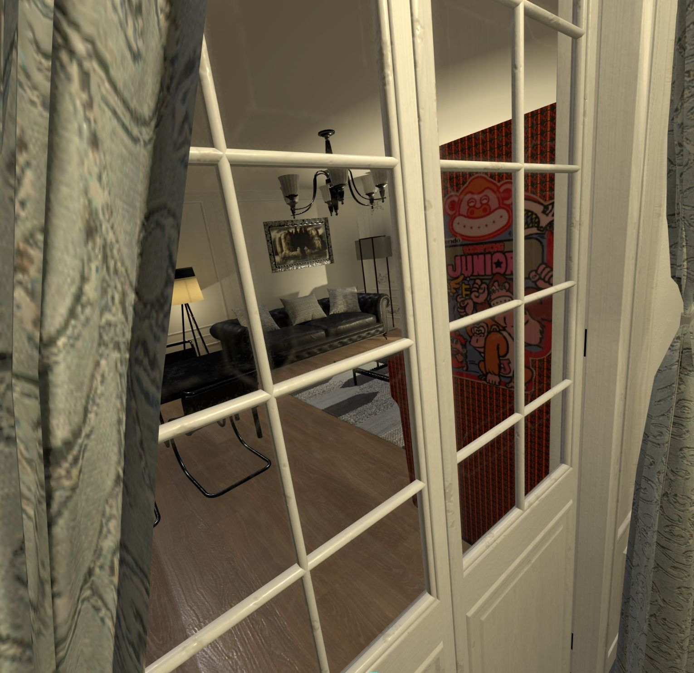
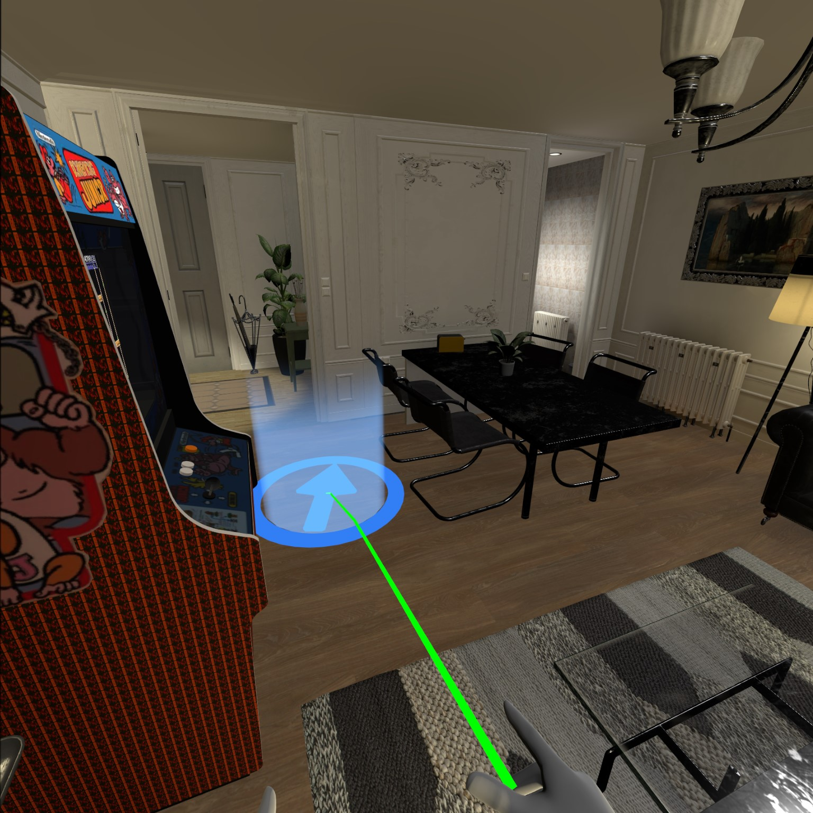
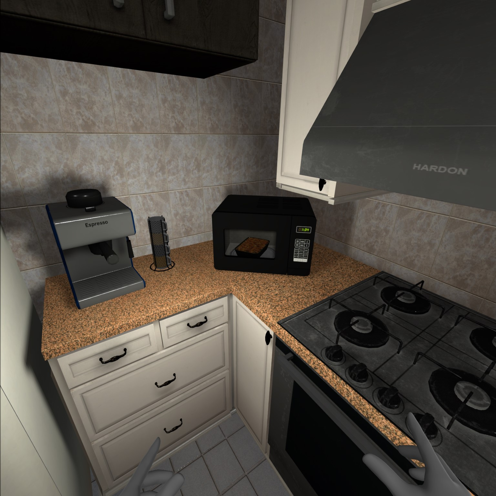

# Unity 3D / C# / Visual Studio - Original house visit development - 'Archviz - Virtual Reality for Oculus Rift' - version 1.0

*January 2020 - Development time: 2 days*

> 🔨 House visit made with Unity 3D (ver. 2019.2.4f1). Visit a non existing house in a realistic 3D environment. It's the VR version for Oculus Rift of my 'Archviz' work (see the repository [here](https://github.com/Raigyo/unity-3d-archviz)).

* * *

## 1. Installation

You need a *high-end computer* and an *Oculus Rift* or an *Oculus Rift S* to run this demo. (If you can test it on HTC Vive or Valve Index, give me your feedback!!!)

### 1.1 Oculus Software

You need the Oculus sofware installed and to allow content from unknown sources.

- Open the Oculus app on your PC computer.
- Select Settings in the left menu.
- Select the General tab.
- Next to Unknown Sources, adjust the toggle and then confirm to allow content from unknown sources.

### 1.2 Windows x86_64

#### 1.2.1 Windows Installer

Download the installer [here](https://drive.google.com/open?id=1nyUdpqEU5V10D-vMKJiu50pfiaXsPvqY) [802Mb] and just follow the instructions.

#### 1.2.2 Zip version

Download the zip with the game [here](https://drive.google.com/open?id=1CduzX2P7fIlMJrez-wmoXrY0amw8shd5) [979Mb] and unzip archviz-vr-windows64.zip on your computer.

In 'archviz-vr-windows64' launch architecture.exe by clicking on it to play.

### 1.3 Mac OSX

Download the zip with the game [here](https://drive.google.com/open?id=1WvVFpTmmvx9Wio8m4xWhrdVnm0L5NCTX) [980Mb] and unzip archviz-vr-mac-osx.zip on your computer.

In 'archviz-vr-mac-osx' launch archviz-mac-osx.app by clicking on it to play.

Warning: It's not an approved Mac App Store application so you will have to select 'allow apps downloaded from anywhere' or click on 'open anyway' on the alert box if you want to launch the game.

### 1.3 Scripts for reviewing

Scripts used are in the [scripts folder](https://github.com/Raigyo/unity-3d-archviz-vr-oculus/tree/master/scripts) on this repository.

*-------*

## 2. About

This application is a showcase in which you can visit a house in VR. The house has been 'build' by me using Unity 3D, some assets from the asset store, Probuilder3D et Progrid components and even a ruler.

### 2.1. How to play

Use the trigger of your Oculus Touch to make the pointer appear. Select the direction with the 'thumbstick' then release the trigger to teleport.

It works with the two controllers so the visit can be enjoyed by right-handed or left-handed according to the Oculus development guidelines.

## 3. Techniques / Assets / Scripts

The app uses the 'Oculus Integration' asset provided by Oculus. I just had to custom some components and elements of the scene to make it works with Oculus Rift.

*-------*

## 4. Credits

### 4.1. Video, Music & Sounds

- [Spring - Blender Open Movie](https://www.youtube.com/watch?v=WhWc3b3KhnY)
- [Lights - Sappheiros ](https://www.youtube.com/watch?v=-lbbHQbZNKg)

––––––––––––––––––––––––––––––

Lights by Sappheiros [https://soundcloud.com/sappheirosmusic](https://soundcloud.com/sappheirosmusic)
Creative Commons — Attribution 3.0 Unported  — CC BY 3.0
Free Download / Stream: [https://bit.ly/LightsSappheiros](https://bit.ly/LightsSappheiros)
Music promoted by Audio Library [https://youtu.be/-lbbHQbZNKg](https://youtu.be/-lbbHQbZNKg)

––––––––––––––––––––––––––––––

### 4.2. Assets used

#### 4.2.1. Unity Asset Store

- [3D Game Kit - Unity Technologies](https://assetstore.unity.com/packages/templates/tutorials/3d-game-kit-115747)
- [ArchVizPRO Interior Vol.3 - ArchVizPRO](https://assetstore.unity.com/packages/3d/environments/archvizpro-interior-vol-3-62337)
- [ArchVizPRO Interior Vol.6 - ArchVizPRO](https://assetstore.unity.com/packages/3d/environments/urban/archvizpro-interior-vol-6-120489)
- [Aura 2 - Volumetric Lighting & Fog - Raphael Ernaelsten](https://assetstore.unity.com/packages/tools/particles-effects/aura-2-volumetric-lighting-fog-137148)
- [Candle Flames - Rivermill Studios](https://assetstore.unity.com/packages/vfx/particles/fire-explosions/candle-flames-48044)
- [Classic Picture Frame - Vertex Studio](https://assetstore.unity.com/packages/3d/props/furniture/classic-picture-frame-59038)
- [Clock - VIS Games](https://assetstore.unity.com/packages/3d/props/interior/clock-4250)
- [Footwear Collection - 3D Everything](https://assetstore.unity.com/packages/3d/props/clothing/footwear-collection-52313)
- [Free Smartphone - Vertex Studio](https://assetstore.unity.com/packages/3d/props/electronics/free-smartphone-90324)
- [House Furniture Pack - Finward Studios](https://assetstore.unity.com/packages/3d/props/house-furniture-pack-88646)
- [Kitchen Appliances with Packaging - Robot Skeleton](https://assetstore.unity.com/packages/3d/props/electronics/kitchen-appliances-with-packaging-155472)
- [Kitchen Props Free - Jake Sullivan](https://assetstore.unity.com/packages/3d/props/interior/kitchen-props-free-80208)
- [MadGoat SSAA & Resolution Scale - MadGoat Studio](https://assetstore.unity.com/packages/vfx/shaders/fullscreen-camera-effects/madgoat-ssaa-resolution-scale-86368)
- [Oculus Integration](https://assetstore.unity.com/packages/tools/integration/oculus-integration-82022)
- [Pegasus - Procedural Worlds](https://assetstore.unity.com/packages/tools/animation/pegasus-65397)
- [Realistic Furniture And Interior Props Pack - Sevastian Marevoy](https://assetstore.unity.com/packages/3d/props/furniture/realistic-furniture-and-interior-props-pack-120379)
- [Shoes Mens / Ladies - Kobra Game Studios](https://assetstore.unity.com/packages/3d/props/clothing/shoes-mens-ladies-73134)
- [Substance in Unity - Allegorithmic](https://assetstore.unity.com/packages/tools/utilities/substance-in-unity-110555)
- [Suburb Neighborhood House Pack Modular - Finward Studios](https://assetstore.unity.com/packages/3d/environments/urban/suburb-neighborhood-house-pack-modular-72712)
- [Ultra Washing Machine PBR - 00Laboratories](https://assetstore.unity.com/packages/3d/props/electronics/ultra-washing-machine-pbr-144339)
- [Umbrella PRO - Indie_G](https://assetstore.unity.com/packages/3d/props/clothing/umbrella-pro-55277)
- [zz Ruler - orange030](https://assetstore.unity.com/packages/tools/utilities/zz-ruler-365)

#### 4.2.2. Free 3D

- [Donkey Kong Jr. - Upright Arcade Machine - daystar65](https://free3d.com/3d-model/donkey-kong-jr-upright-arcade-machine-89019.html)

#### 4.2.3. Turbosquid

- [3D Dauphine Floor Lamp model - Designconnected ](https://www.turbosquid.com/FullPreview/Index.cfm/ID/1388560)
- [Coat tree black painted metall - yuriki](https://www.turbosquid.com/FullPreview/Index.cfm/ID/967969)
- [Green apples - modelplusmodel ](https://www.turbosquid.com/FullPreview/Index.cfm/ID/546276)
- [Thai Sandstone Female model - Hane3D](https://www.turbosquid.com/FullPreview/Index.cfm/ID/1275160)

#### 4.2.4. Cults3d

- [Business card holder - Kevin Gallagher](https://cults3d.com/en/3d-model/various/business-card-holder-donegal3d)

#### 4.2.5. 3DDD

- [Forged umbrella stand - koffer](https://3ddd.ru/3dmodels/show/kovannaia_podstavka_pod_zont)

*-------*

## 5. Useful links & Greetings

- [Brackeys Game Dev Tutorials](https://www.youtube.com/channel/UCYbK_tjZ2OrIZFBvU6CCMiA)
- [DitzelGames](https://www.youtube.com/channel/UCdedu-nAwMACE5WbVcmp3Bg)
- [Epitome](https://www.youtube.com/channel/UCsaXQNLxeHvwJdDUrICGufA)
- [IMERSITY](https://www.youtube.com/channel/UCCCf8Z1iY3yXQUxcnarA0Ag)
- [Info Gamer](https://www.youtube.com/channel/UCyoayn_uVt2I55ZCUuBVRcQ)
- [inScope Studios](https://www.youtube.com/channel/UCyVsCcTte38YC9CxJtw3hBQ)
- [Jason Weimann - Unity 3D College](https://www.youtube.com/channel/UCX_b3NNQN5bzExm-22-NVVg)
- [Learn Everything Fast](https://www.youtube.com/channel/UCG5XadFg6icC2TcF0I5DIig)
- [Raywenderlich](https://www.raywenderlich.com/)
- [SpeedTutor](https://www.youtube.com/channel/UCwYuQIa9lgjvDiZryUVtFGw)
- [Sykoo](https://www.youtube.com/channel/UCNJvwJ6daLmw4_gUKTw4cSg)
- [Sylvain - Créateur 3D](https://www.youtube.com/channel/UC8BM2xQlXcK4Vt3OqfOmj9g)
- [TUTO UNITY FR](https://www.youtube.com/channel/UCJRwb5W4ZzG43J5_dViL6Fw)
- [Unity Guruz](https://www.youtube.com/channel/UCgd3l8iA5zBYVa4sQ6-ONFw)
- [Unity Learn](https://learn.unity.com/)
- [Unity Pour les nuls](https://www.youtube.com/channel/UCuU8cONIgZ182KheI1s6HqQ)
- [Unity3D With Scott](https://www.youtube.com/channel/UC9hfBvn17qSIrdFwAk56oZg)
- [Valem](https://www.youtube.com/channel/UCPJlesN59MzHPPCp0Lg8sLw)

*-------*

## 6. Contact (Github / Linked In)

- [My Github](https://github.com/Raigyo)
- [My LinkedIn](https://www.linkedin.com/in/vincent-chilot/)

